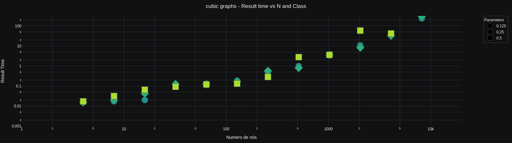
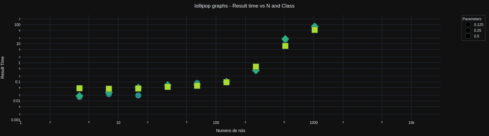

# MaxHappySet solver results: time vs N & Class & K

# Maximum Happy Set problem (MaxHS)
For an undirected graph G = (V, E) and a subset S ⊆ V of vertices, a vertex
v is happy if v and all its neighbors are in S; otherwise unhappy. Given an
undirected graph G = (V, E) and an integer k, the goal of MaxHS is to find a
subset S ⊆V of k vertices such that the number of happy vertices is maximized.
max ∑_i∈V hi
s.t. ∑_i∈V yi = k,
hi ≤yi, ∀i ∈V,
hi ≤yj , ∀i ∈V, j ∈N (i),
hi ≥∑_j∈N(i)yj −|N (i)|+ yi, ∀i ∈V,
y ∈ B|V|
